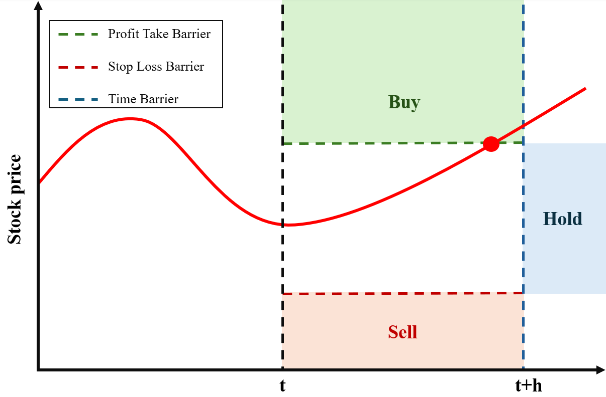

# 📈 Projet de Finance Quantitative – Genetic Algorithm-Optimized Triple Barrier Labeling for Bitcoin Trading Based on GBMs Stacking Prediction

<p align="center">

</p>

## 📝 Description  
Ce projet explore l'application d'une méthode de labeling **Triple Barrier** introduite en 2018 par Marcos Lopez de Prado. Celle-ci est optimisée à l'aide d'un **Algorithme Génétique** pour maximiser les performances financières.
Le labeling est appliqué aux données **Bitcoin**, générant trois catégories de signaux : Buy, Hold et Sell.
Une fois l'ensemble de données labélisées construit, j'utilise un modèle de classification pour prédire les signaux à partir de données agrégées. En intégrant
des variables macroéconomiques, des scores de sentiment déduits des tweets à l'aide d'un
modèle BERTweet et des mesures spécifiques au Bitcoin, j'utilise un
modèle de **Stacking** combinant **3 GBMs (XGBoost, Light-GBM, CatBoost)** avec un meta-classifier **Softmax**. Les hyperparamètres de ces modèles sont optimisés via **Optimisation Bayésienne**.
Les décisions de trading dérivées de ces prédictions sont évaluées à l'aide de métriques de performance financière telles que le **profit**, **le maximum drawdown** et le **Sharpe ratio**,
et sont comparées à des approches d'investissement plus traditionnelles telles que le simple Hold et le DCA (Dollars Cost Averaging).

## 📂 Structure du projet  

### 🔹 **Notebooks Jupyter**  
- **`df_builder.ipynb`** : Construction des datasets d'entraînement et de test à partir des données disponibles
- **`predict.ipynb`** :  Entraînement du modèle de prédiction, génération des prévisions, comparaison des stratégies de trading  

### 🔹 **Script FastAPI**  
- **`main.py`** : Définit une API **FastAPI** pour intéragir avec différentes composantes du projet

### 🔹 **Folders**  
- **`services/df_building`** : Folder des modules du df_builder.ipynb
- **`services/prediction`** : Folder des modules de predict.ipynb
- **`routers/`** : Folder des routers de l'API


## 🚀 Installation & Exécution

Clone the repository  
```bash
git clone https://github.com/louis-lebreton/triple_barrier_prediction.git
```

Installation des dépendances
Clonez le dépôt :

```bash
git clone https://github.com/louis-lebreton/triple_barrier_prediction.git
cd triple_barrier_prediction
```
Assurez-vous d'avoir Poetry installé. Si ce n'est pas le cas, installez-le avec :

```bash
pip install poetry
```
Créez et activez l'environnement virtuel, puis installez les dépendances :

```bash
poetry install
```


